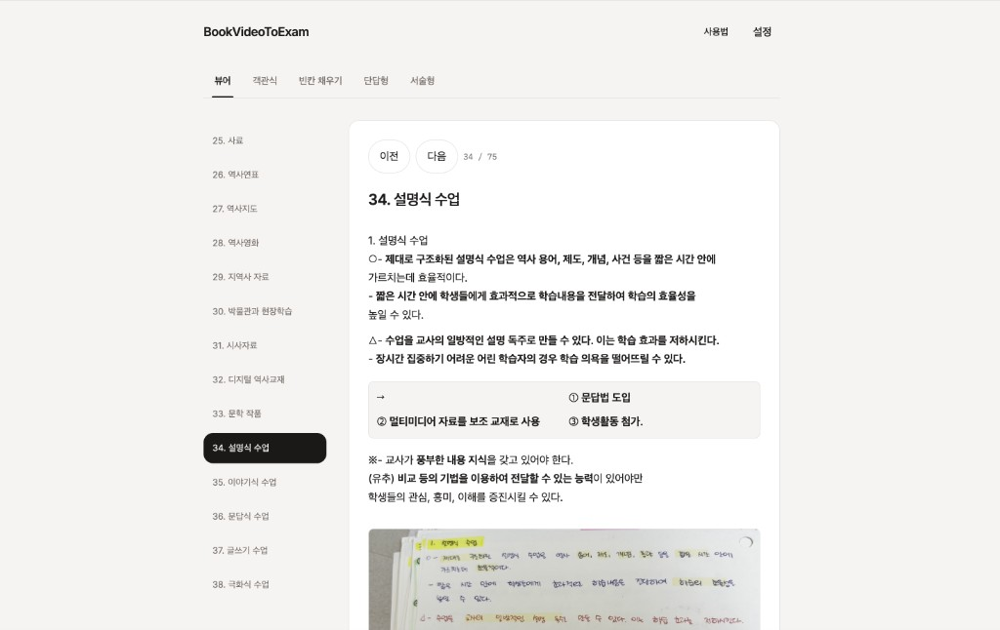
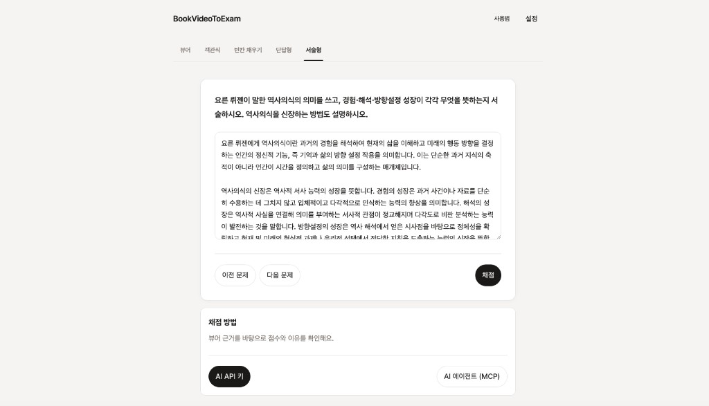

<p align="center">
  
</p>

# Book To Exam

교재 자료를 받아 뷰어와 시험지로 만듭니다. 책 넘기는 영상뿐 아니라 캡처본, PDF, DOCX, HWP도 됩니다.

**서비스 바로가기:** [https://bookvideotoexam.pages.dev](https://bookvideotoexam.pages.dev)

사용법은 사이트 안 [사용법](https://bookvideotoexam.pages.dev/guide)에서 바로 눌러 볼 수 있습니다.

## 스크린샷

### 뷰어

교재 쪽과 메모를 같이 봅니다.



### 서술형

답을 쓴 뒤 사용자 AI로 채점합니다. API 키를 넣거나, 에이전트에 MCP 프롬프트를 붙여 넣습니다.



## 사용 방법

1. 교재 자료를 [rlaalsdn456456@naver.com](mailto:rlaalsdn456456@naver.com)으로 보냅니다. 넘기는 영상, 화면 캡처, `.pdf`, `.docx`, `.hwp`를 받습니다.
2. 시험지 링크는 완성되면 답장합니다.
3. 예시 사이트에서 뷰어, 객관식, 빈칸 채우기, 단답형, 서술형을 풀어 볼 수 있습니다.

## 예시 사이트

| 화면 | 주소 | 내용 |
| --- | --- | --- |
| 랜딩 | [/ ](https://bookvideotoexam.pages.dev/) | 보내는 자료와 예시 |
| 사용법 | [/guide](https://bookvideotoexam.pages.dev/guide) | 화면을 직접 눌러 보는 안내 |
| 뷰어 | [/viewer](https://bookvideotoexam.pages.dev/viewer) | 쪽 사진과 메모 |
| 객관식 | [/quiz](https://bookvideotoexam.pages.dev/quiz) | 보기 선택 후 채점 |
| 빈칸 | [/blank](https://bookvideotoexam.pages.dev/blank) | 뷰어 앞뒤 글을 보고 빈칸을 채움 |
| 단답 | [/short](https://bookvideotoexam.pages.dev/short) | 용어를 정확히 씀 |
| 서술형 | [/essay](https://bookvideotoexam.pages.dev/essay) | 사용자 AI로 채점 |

서술형 채점에는 사용자 AI가 필요합니다.

- **AI API 키:** 키를 넣은 뒤 모델 목록을 불러오고, 쓸 모델을 고른 다음 채점합니다. Gemini, OpenAI, Claude, Groq, OpenRouter, DeepSeek를 쓸 수 있습니다. 키는 이 브라우저에서만 쓰고 사이트에 저장하지 않습니다.
- **AI 에이전트 (MCP):** 화면에 나온 프롬프트를 복사해 에이전트에 붙여 넣습니다. `tools/list`에 `score`가 있어야 합니다. 점수와 이유는 에이전트 채팅에서 확인합니다.

## 로컬 실행

```bash
npm install
npm run dev -- --host 127.0.0.1 --port 4179
```

검증: `npm test` / `npm run build`

문제의 이전/다음 이동은 채점 여부와 무관하며, 같은 화면에서 답안과 결과를 유지합니다.

## 채점 규칙

- 단답형과 용어 빈칸은 공백만 무시하는 정확 일치입니다. 문장 빈칸은 `public/data/blanks.json`의 필수 핵심어 그룹과 모순 표현으로 판정합니다. 빈칸의 앞·답·뒤를 합치면 해당 뷰어 원문과 일치합니다.
- 서술형 문항 목록은 공개되지만 사전 기준과 기준별 뷰어 인용은 `functions/_data/essays.json`에 둡니다. 기준을 수정하면 버전도 올리고, 테스트로 원문 인용을 확인합니다.
- API 키 채점은 `POST /api/score { essayId, answer, provider, apiKey, model }`입니다. 키를 넣은 뒤 `POST /api/models`로 목록을 받아 모델을 고릅니다. 클라이언트가 보낸 기준은 신뢰하지 않습니다. 서버가 기준과 근거를 모으고 모델을 호출한 뒤 항목 점수·답안 인용·뷰어 인용을 검증합니다.
- MCP 주소는 `/api/mcp/<id>`입니다. 같은 URL에서 JSON-RPC `initialize`, `tools/list`, `tools/call`을 지원합니다. 첫 도구는 `score`입니다. `score({essayId,answer})`가 채점 문맥을 준비하고, 연결된 에이전트가 평가한 뒤 `score({essayId,answer,assessment})`로 검증합니다. `get_essay`만으로 채점하지 않습니다. 점수는 에이전트 채팅에 나타나며 웹 화면으로 자동 동기화하지 않습니다. 검증은 점수 범위와 인용 출처를 확인하며, AI의 의미 판단까지 보장하지 않습니다.
- 로컬 Vite도 같은 API 핸들러를 실행합니다. 테스트는 모델 응답을 모의 처리하므로 실제 모델의 채점 품질 검증과 구분합니다.

## 교재 준비 파이프라인

기존 Smart Textbook Pipeline의 코드·문서·MIT 라이선스·Git 이력을 이 저장소의 [`tools/smart-textbook-pipeline/`](tools/smart-textbook-pipeline/)로 통합했습니다.

- [작업 규칙](tools/smart-textbook-pipeline/SKILL.md): 스캔·영상 프레임을 비전 모델로 전사하고 원문과 대조하는 방법
- [실전 기록](tools/smart-textbook-pipeline/docs/lessons.md): 쪽수, 펼침면, OCR 오류와 검수 과정
- [도구 실행 안내](tools/smart-textbook-pipeline/README.md): Apple Vision OCR 힌트 생성과 독립 HTML 뷰어 조립

저장소 루트에서 아래 명령으로 실행합니다. Apple Vision OCR에는 macOS와 Swift 도구가 필요합니다.

```bash
npm run textbook:viewer -- --help
npm run textbook:viewer -- --images /path/to/scans --cache /path/to/ocr-cache --output /path/to/viewer.html
npm run textbook:test
```

이 도구의 OCR 결과는 검수용 힌트입니다. 본문 전사·쪽수 확인을 거쳐 교재를 준비하며, 생성한 HTML이 서비스의 시험 데이터로 자동 등록되지는 않습니다.
