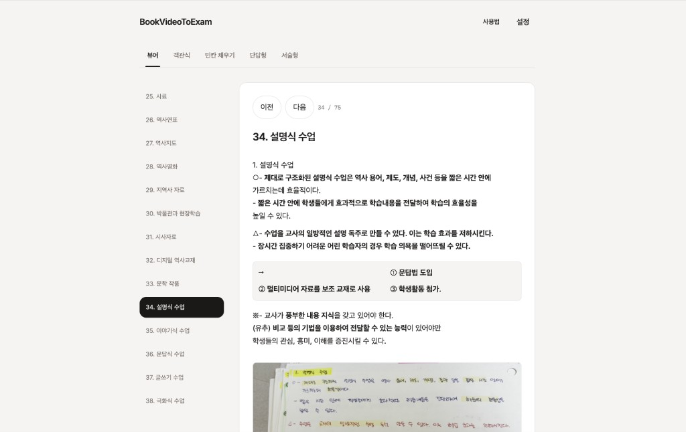
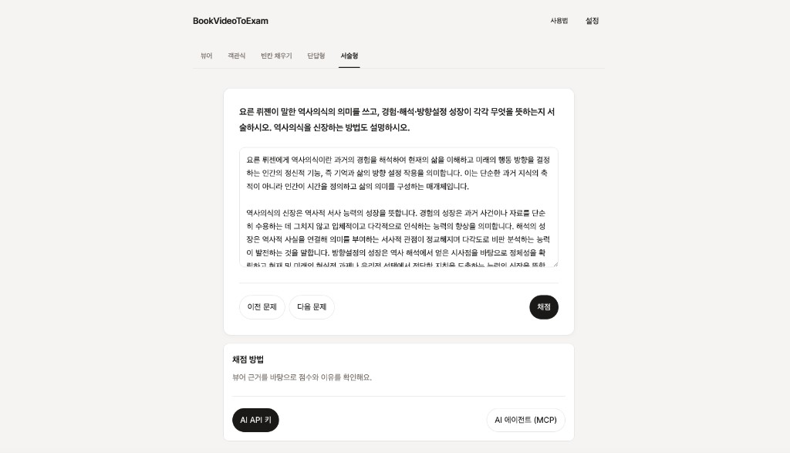

<p align="center">
  
</p>

# Book To Exam

<!-- PROJECT-PRESENTATION:START -->
<a href="https://bookvideotoexam.pages.dev"></a>

[](https://bookvideotoexam.pages.dev) [](#사용-방법) [](https://github.com/minwoo19930301/book-to-exam)
<!-- PROJECT-PRESENTATION:END -->

교재 자료를 받아 뷰어와 시험지로 만듭니다. 책 넘기는 영상뿐 아니라 캡처본, PDF, DOCX, HWP도 됩니다.

**서비스 바로가기:** [https://bookvideotoexam.pages.dev](https://bookvideotoexam.pages.dev)

사용법은 사이트 안 [사용법](https://bookvideotoexam.pages.dev/guide)에서 바로 눌러 볼 수 있습니다.

## 스크린샷

### 뷰어

교재 쪽과 메모를 같이 봅니다.



### 서술형

답을 쓴 뒤 사용자 AI로 채점합니다. API 키를 넣거나, 에이전트에 MCP 프롬프트를 붙여 넣습니다.



## 사용 방법

1. 교재 자료를 [rlaalsdn456456@naver.com](mailto:rlaalsdn456456@naver.com)으로 보냅니다. 넘기는 영상, 화면 캡처, `.pdf`, `.docx`, `.hwp`를 받습니다.
2. 시험지 링크는 완성되면 답장합니다.
3. 예시 사이트에서 뷰어, 객관식, 빈칸 채우기, 단답형, 서술형을 풀어 볼 수 있습니다.

## 예시 사이트

| 화면 | 주소 | 내용 |
| --- | --- | --- |
| 랜딩 | [/ ](https://bookvideotoexam.pages.dev/) | 보내는 자료와 예시 |
| 사용법 | [/guide](https://bookvideotoexam.pages.dev/guide) | 화면을 직접 눌러 보는 안내 |
| 뷰어 | [/viewer](https://bookvideotoexam.pages.dev/viewer) | 쪽 사진과 메모 |
| 객관식 | [/quiz](https://bookvideotoexam.pages.dev/quiz) | 보기 선택 후 채점 |
| 빈칸 | [/blank](https://bookvideotoexam.pages.dev/blank) | 뷰어 앞뒤 글을 보고 빈칸을 채움 |
| 단답 | [/short](https://bookvideotoexam.pages.dev/short) | 용어를 정확히 씀 |
| 서술형 | [/essay](https://bookvideotoexam.pages.dev/essay) | 사용자 AI로 채점 |
| 전체 문제은행 | [/questions](https://bookvideotoexam.pages.dev/questions?subject=all&pageSize=50) | 1,477개 검색·과목/유형 필터·정답/해설 펼치기 |
| 연구 예상문항 | [/questions?type=research](https://bookvideotoexam.pages.dev/questions?type=research&pageSize=50) | 논문 기반 서술형 24개·모범답안·채점 기준 |

서술형 채점에는 사용자 AI가 필요합니다.

- **AI API 키:** 키를 넣은 뒤 모델 목록을 불러오고, 쓸 모델을 고른 다음 채점합니다. Gemini, OpenAI, Claude, Groq, OpenRouter, DeepSeek를 쓸 수 있습니다. 키는 이 브라우저에서만 쓰고 사이트에 저장하지 않습니다.
- **AI 에이전트 (MCP):** 화면에 나온 프롬프트를 복사해 에이전트에 붙여 넣습니다. `tools/list`에 `score`가 있어야 합니다. 점수와 이유는 에이전트 채팅에서 확인합니다.

## 로컬 실행

```bash
npm install
npm run dev -- --host 127.0.0.1 --port 4179
```

검증: `npm test` / `npm run build`

문제의 이전/다음 이동은 채점 여부와 무관하며, 같은 화면에서 답안과 결과를 유지합니다.

## 채점 규칙

- 단답형과 용어 빈칸은 공백만 무시하는 정확 일치입니다. 문장 빈칸은 `public/data/blanks.json`의 필수 핵심어 그룹과 모순 표현으로 판정합니다. 빈칸의 앞·답·뒤를 합치면 해당 뷰어 원문과 일치합니다.
- 서술형의 정식 기준과 기준별 뷰어 인용은 `functions/_data/essays.json`과 과목별 서버 파일에 둡니다. 시험 화면의 정적 문항 목록은 답안을 포함하지 않습니다. 공개 연습용 `/questions`는 읽기 전용 `/api/practice-bank`에서 모범답안과 기준을 받아 펼쳐 볼 수 있습니다. 기준을 수정하면 버전도 올리고, 테스트로 원문 인용을 확인합니다.
- API 키 채점은 `POST /api/score { essayId, answer, provider, apiKey, model }`입니다. 키를 넣은 뒤 `POST /api/models`로 목록을 받아 모델을 고릅니다. 클라이언트가 보낸 기준은 신뢰하지 않습니다. 서버가 기준과 근거를 모으고 모델을 호출한 뒤 항목 점수·답안 인용·뷰어 인용을 검증합니다.
- MCP 주소는 `/api/mcp/<id>`입니다. 같은 URL에서 JSON-RPC `initialize`, `tools/list`, `tools/call`을 지원합니다. 채점은 `score({essayId,answer})`로 문맥을 준비하고, 연결된 에이전트가 평가한 뒤 `score({essayId,answer,assessment})`로 검증합니다. `get_essay`만으로 채점하지 않습니다. 점수는 에이전트 채팅에 나타나며 웹 화면으로 자동 동기화하지 않습니다. 검증은 점수 범위와 인용 출처를 확인하며, AI의 의미 판단까지 보장하지 않습니다. 새 문항 작성은 아래 압축 KB와 출제 준비 도구를 이용합니다.
- 로컬 Vite도 같은 API 핸들러를 실행합니다. 테스트는 모델 응답을 모의 처리하므로 실제 모델의 채점 품질 검증과 구분합니다.

채점은 [공개 학원 해설 조사](knowledge/grading-research/README.md)를 참고해 요구조건·개념 수준·의미 동치·자료 맥락을 구분합니다. 문항별 허용 점수와 채점 요소를 API·MCP·Chrome 내장 AI에 동일하게 전달합니다. 학원의 예시답안·추정 인정 범위는 공식 임용 채점표로 표시하지 않습니다.

## 교재 준비 파이프라인

기존 Smart Textbook Pipeline의 코드·문서·MIT 라이선스·Git 이력을 이 저장소의 [`tools/smart-textbook-pipeline/`](tools/smart-textbook-pipeline/)로 통합했습니다.

- [작업 규칙](tools/smart-textbook-pipeline/SKILL.md): 스캔·영상 프레임을 비전 모델로 전사하고 원문과 대조하는 방법
- [실전 기록](tools/smart-textbook-pipeline/docs/lessons.md): 쪽수, 펼침면, OCR 오류와 검수 과정
- [도구 실행 안내](tools/smart-textbook-pipeline/README.md): Apple Vision OCR 힌트 생성과 독립 HTML 뷰어 조립

저장소 루트에서 아래 명령으로 실행합니다. Apple Vision OCR에는 macOS와 Swift 도구가 필요합니다.

```bash
npm run textbook:viewer -- --help
npm run textbook:viewer -- --images /path/to/scans --cache /path/to/ocr-cache --output /path/to/viewer.html
npm run textbook:test
```

이 도구의 OCR 결과는 검수용 힌트입니다. 본문 전사·쪽수 확인을 거쳐 교재를 준비하며, 생성한 HTML이 서비스의 시험 데이터로 자동 등록되지는 않습니다.

## Chrome Canary 내장 AI 채점 (실험)

서술형의 **Chrome Canary AI (실험)**을 선택합니다. 별도 Gemma 모델 런타임 대신
Chrome의 `LanguageModel` Prompt API를 사용합니다. 모델 이름·다운로드는 Chrome이
관리하며, Canary 설치만으로 모든 기기에서 실행되는 것은 아닙니다.

1. 사용자의 실행 클릭으로 내장 AI 세션을 준비합니다.
2. `POST /api/score`의 `mode: browser-prepare`에 문항 ID·답안을 보내 사전 기준과 교재 근거를 받습니다.
3. 기기의 Chrome 내장 AI가 평가합니다. 사용자 API 키나 운영자 유료 추론 API를 호출하지 않습니다.
4. 같은 API의 `mode: browser-finalize`에 답안·평가·기준 버전을 보냅니다. 서버가 정식 기준으로 항목 점수와 인용을 검증하고 총점을 반환합니다.

답안과 평가 결과는 사이트 API로 전송됩니다. 모델 추론만 기기에서 실행됩니다.
지원되지 않거나 실패하면 유료 AI로 자동 전환하지 않습니다. 중단·화면 이동 시
세션을 해제합니다. 한국어 채점은 실험 단계이며 인용 검증이 의미 판단의 정확성을
보장하지 않습니다. 기기별 실제 평가 품질은 별도 확인해야 합니다.

등록된 서술형은 문항별 교재 근거와 채점 기준으로 평가합니다. 새 출제를 위한 내부
Markdown KB는 아래에 설명합니다. 벡터 DB나 운영비 절감 실측은 구현하지 않았습니다.

## 과목별 교재와 출제 지식

`/menu`에서 손글씨 메모·서양사·한국사·동양사·역사교육론을 선택합니다.
교재 뷰어는 원문 전사와 분리한 사진·지도·도표를 보여주며 객관식·빈칸·단답·서술형으로 이어집니다. 사용자용 개념 위키는 제공하지 않습니다. 기존 `/wiki` 주소는 과목을 유지하여 교재로 이동합니다.

- `knowledge/compact/<subject>/*.md`: 내부 출제용으로 선별·압축한 핵심, 비교·함정, 출제 판단과 보류 사유.
- [지식 목차](knowledge/index.md) · [선별 기준](knowledge/selection-policy.md) · [출처 방법](knowledge/methodology.md).
- `public/data/subjects/*/notes.json`: 원문 근거 데이터. KB에 원문을 통째로 복제하지 않습니다.
- `public/figures/`: 원본에서 분리한 실제 그림. 좌표·출처는 `tools/history-figures/manifest-*.json`에 보존합니다.
- `functions/_data/knowledge.json`: Markdown을 컴파일한 내부 검색 자료. 편집 원본은 Markdown입니다.

MCP의 `search_knowledge` → `get_knowledge`로 필요한 작은 문서만 읽고, `get_note`로 원문과 그림을 확인합니다. `search_exam_sources`/`get_exam_source`는 평가원 근거를 별도로 조회합니다. 중요도는 출제 가능한 비교·인과·사료 판별을 기준으로 선별한 편집 판단이며 출제 확률 통계가 아닙니다. 전사·해설의 불명확한 부분은 자동 정답으로 승격하지 않습니다.

`prepare_exam`은 과목·주제에 맞는 압축 문서 최대 3개와 제한된 원문 발췌, 검증된 기출 연결, 실제 그림 정보를 묶어 에이전트의 출제를 준비합니다. 모델을 호출하거나 문항을 자동 등록하지 않습니다. 에이전트는 보류 사유를 확인하고 정답·선지·채점 기준의 근거를 남겨 검수해야 합니다. 초기 111문항을 유지하고 서양사·한국사·동양사·역사교육론에 각각 300문항(총 1,200개)을 추가했습니다. `tools/history-questions/extended-inputs/`의 집필 입력과 원문 인용·오답 해설·문항별 채점 기준을 검증해 가져옵니다. 교재 기반 연습은행은 총 1,311문항이며, 기존 손글씨 142문항을 포함하면 1,453문항입니다. 새 KB를 편집한다고 은행이 자동 변경되지는 않습니다.

공개 연구 참고 교수 27명·연구 JSON 87항목(핵심 검토 72항목)을 별도 조사했습니다. 논문 기반 예상 서술형 24개는 연구 초안이며 `prepare_exam`의 연구 검색과 `get_prediction`의 모범답안·채점 기준 조회로 연결됩니다. 공개 문제은행에서도 ‘연구 예상문항’ 유형으로 읽을 수 있습니다. `get_research_stats`는 서지·초록·본문 일부의 확인 범위를 구별해 집계합니다. [문항·연구 검증 기록](knowledge/prediction-research/validation-report.md)에 실제 확인 범위와 한계를 남겼습니다.

논문 기반 예상문항·공개 교수 연구분야·학원 자료 대조는 [출제 연구](knowledge/prediction-research/README.md)에 보존합니다. 논문별로 서지 확인·초록·본문 선별 검토를 구분하며, 특정 연구자의 실제 출제 참여나 정량적 적중률을 추정하지 않습니다. 조사 결과는 내부 출제 자료이며 공개 개념 위키 화면을 만들지 않습니다.

```sh
npm run kb:import -- --source /path/to/smart-textbooks
npm run kb:questions
npm run kb:compile
npm run kb:validate -- --source /path/to/smart-textbooks
npm test
npm run build
```

그림 재현은 [수집·크롭·검수 절차](tools/history-figures/README.md)를 따릅니다. 원문은 고정 커밋에서 가져온 기존 전사로 전체 내용 검수 전입니다. 2026-10-04 공개 문제은행 배포 요청에 따라 문제·해설·연구 예상문항을 사이트에서 열람하도록 연결했습니다. 원본 PDF와 전체 스캔 사진은 배포에 추가하지 않았습니다.

## 배포

기존 Cloudflare Pages 프로젝트 `bookvideotoexam`을 사용합니다. GitHub push만으로 자동 배포되는 프로젝트가 아니며, 검토한 커밋을 푸시한 뒤 `npm run deploy:pages`로 production(`main`)에 직접 올립니다. 이 명령은 커밋되지 않은 변경과 푸시되지 않은 커밋을 거부하고, 빌드·배포 후 사이트의 실제 커밋·문항 수·검색·그림·MCP를 확인합니다. 기존 Wrangler 로그인만 사용하며 별도 키를 저장소에 넣지 않습니다.

`/release.json`은 빌드한 커밋과 소스 브랜치를 표시합니다. 수동 재검증은 `npm run deploy:verify -- https://bookvideotoexam.pages.dev <40자리-커밋>`으로 수행합니다. 빌드에서 생성되는 `public/release.json`은 Git에 포함하지 않습니다.

검증 기록 (2026-09-22): 단위·통합 테스트 12개 및 프로덕션 빌드 통과.
로컬 일반 Chrome의 실제 내장 AI → API 검증 → 점수·근거 표시까지 확인했습니다.
Canary 자체의 실행 완료는 아직 검증하지 못했습니다. 표본 답안에서 모델이 실제
작성된 2차개념 설명을 누락으로 판단한 사례가 있어, 한국어 채점 정확도 검증은
완료되지 않았습니다. 배포 전 로컬 검증 기록입니다.


채점 화면의 설정 가이드에서 Canary 설치, Prompt API 설정, 재시작, 모델 준비 확인을 순서대로 안내합니다. 설정 주소 복사와 준비 상태 확인 버튼을 제공합니다.
